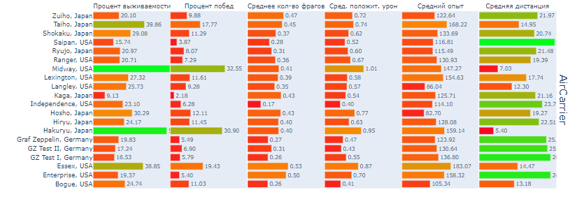

### Анализ данных игры с помощью библиотеки pandas и визуализация c matplotlib.
База данных - sqlite.
Нужно добавить файл базы с названием Dataset.db в корневой каталог 

Для запуска установить зависимости 
```python
pip install -r requirements.txt
```
Запуск в корне каталога:
```python
python3 main.py
```


Пример визуализации:

